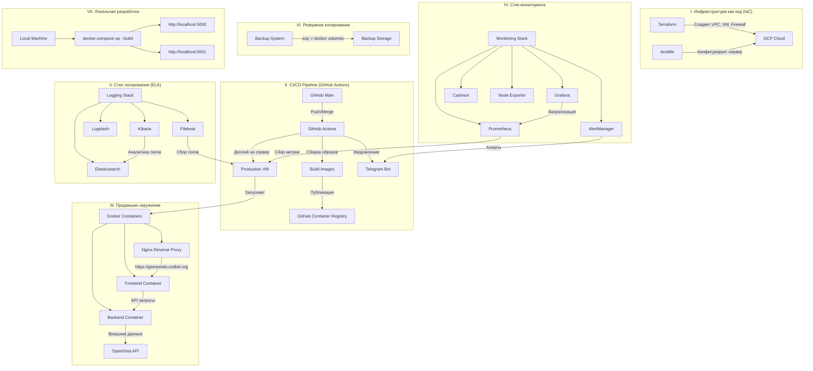

#### **ИГРОВОЙ ИНФОРМАЦИОННЫЙ ПОРТАЛ**

**"GameStats Hub"**

Игровой информационный портал для статистики, рейтингов игроков и аналитики,а также свежих новостей с мира Dota 2. Построен с использованием современных DevOps практик и полной автоматизацией инфраструктуры.

**Функционал:**
- **Статистика игроков**
- **Рейтинги и лидерборды**
- **Новости и патч-ноуты**
- **Сравнение игроков**

**API:**
- **Dota 2:** OpenDota API

**Технологии:**
- **VCS:** GitHub
- **Контейнеризация:** Docker
- **Веб-приложение:** Python Flask, HTML + CSS + JS, Bootstrap
- **CI/CD:** GitHub Actions
- **IaC:** Terraform, Ansible
- **Мониторинг:** Prometheus, Grafana, AlertManager,Cadvisor
- **Логирование:** ELK Stack (Elasticsearch, Kibana, Logstash,Filebeat)
- **Веб-серверы:** Nginx
- **Бекапы:** scp -r 
- **Уведомления:** Telegram Bot
- **Облачные платформы:** GCP
- **CDN:** Cloudflare


##  Продакшен-развертывание и CI/CD

### Развертывание в продакшене (GCP)

1.  **Инфраструктура автоматизирована** с помощью Terraform:
    ```bash
    cd infrastructure/terraform
    terraform apply
    ```
    *Создает VPC, firewall rules и виртуальные машины в GCP*

2.  **Конфигурация сервера** автоматизирована с помощью Ansible:
    ```bash
    cd infrastructure/ansible  
    ansible-playbook -i inventory.ini playbook.yml ssh-playbook.yml monitoring-playbook.yml node_exporter_install.yml logging-playbook.yml ngnix-reverse-proxy.yml backup.yml --ask-vault-password 
    ```
    *Устанавливает Docker, настраивает окружение и запускает контейнеры(frontend,backend)*
    *Запрещает доступ по паролю (доступ по ssh ключу)*
    *Устанавливает и настраивает стек мониторинга : prometheus,grafana,alertmanager,cadvisor*
    *Устанавливает и настраивает node_exporter*
    *Устанавливает и настраивает стек логирования : elasticsearch,kibana,logstash,filebeat*
    *Устанавливает и настраивает reverse-proxy*
    *Настраивае backup docker volume *

3.  **Доступ к приложению:**
    *   Production Frontend: https://gamestats.svdbel.org
    *   Production Backend: http://localhost:5001

###  Автоматический CI/CD Pipeline

При любом пуше в ветку `main` автоматически:
1.  **Собираются Docker образы** и пушатся в GitHub Container Registry
2.  **Развертывается новая версия** на продакшен-сервере в GCP  
3.  **Присылается уведомление** в Telegram о успешном деплое

###  Локальная разработка

1.  Клонируйте репозиторий:
    ```bash
    git clone <your-repo-url>
    cd GameStatsHub
    ```

2.  Запустите сборку и запуск контейнеров:
    ```bash
    docker-compose up --build
    ```

3.  Откройте в браузере:
    *   Локальный Frontend: `http://localhost:5000`
    *   Локальный Backend: `http://localhost:5001`

###  Доступные окружения

| Окружение | Frontend | Backend | Доступ |
|-----------|----------|---------|---------|
| **Локальное** | http://localhost:5000        | http://localhost:5001 | Разработка |
| **Прод**      | https://gamestats.svdbel.org |                       | Production |

**CI/CD полностью автоматизирован** - код из `main` ветки автоматически становится продакшен-версией!

# GameStats Hub Architecture
