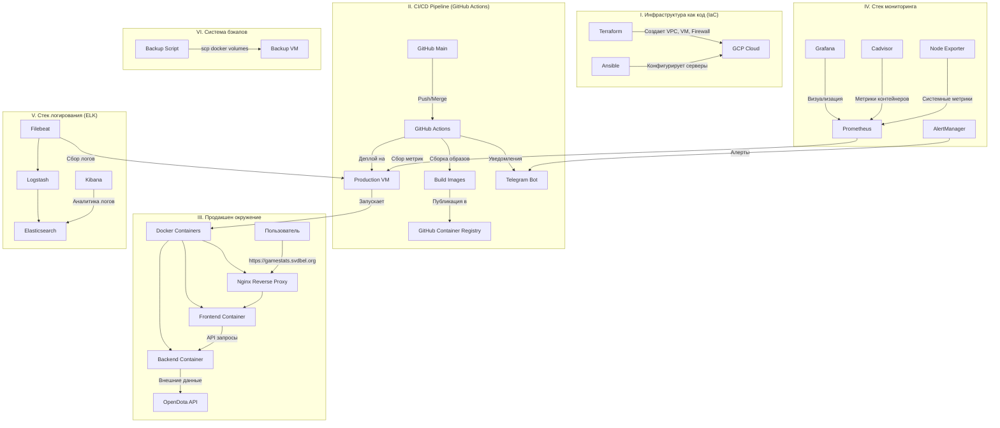

#### **ИГРОВОЙ ИНФОРМАЦИОННЫЙ ПОРТАЛ**

**"GameStats Hub"**

Игровой информационный портал для статистики, рейтингов игроков и аналитики,а также свежих новостей с мира Dota 2. Построен с использованием современных DevOps практик и полной автоматизацией инфраструктуры.

**Функционал:**
- **Статистика игроков**
- **Рейтинги и лидерборды**
- **Новости и патч-ноуты**
- **Сравнение игроков**

## Архитектура:


```mermaid
graph TD
    %% Infrastructure Provisioning & Configuration
    subgraph "I. Инфраструктура как код (IaC)"
        Terraform[Terraform] -- "Создает VPC, VM, Firewall" --> GCP[GCP Cloud]
        Ansible[Ansible] -- "Конфигурирует серверы" --> GCP
    end

    %% CI/CD Pipeline
    subgraph "II. CI/CD Pipeline (GitHub Actions)"
        GitHub[GitHub Main] -- "Push/Merge" --> GitHubActions[GitHub Actions]
        GitHubActions -- "Сборка образов" --> DockerBuild[Build Images]
        DockerBuild -- "Публикация в" --> GHCR[GitHub Container Registry]
        GitHubActions -- "Деплой на" --> ProductionVM[Production VM]
        GitHubActions -- "Уведомления" --> TelegramBot[Telegram Bot]
    end

    %% Production Environment
    subgraph "III. Продакшен окружение"
        ProductionVM -- "Запускает" --> DockerContainers[Docker Containers]
        
        DockerContainers --> Frontend[Frontend Container]
        DockerContainers --> Backend[Backend Container]
        DockerContainers --> Nginx[Nginx Reverse Proxy]
        
        User[Пользователь] -- "https://gamestats.svdbel.org" --> Nginx
        Nginx --> Frontend
        Frontend -- "API запросы" --> Backend
        Backend -- "Внешние данные" --> OpenDotaAPI[OpenDota API]
    end

    %% Monitoring Stack
    subgraph "IV. Стек мониторинга"
        Prometheus[Prometheus] -- "Сбор метрик" --> ProductionVM
        Grafana[Grafana] -- "Визуализация" --> Prometheus
        AlertManager[AlertManager] -- "Алерты" --> TelegramBot
        Cadvisor[Cadvisor] -- "Метрики контейнеров" --> Prometheus
        NodeExporter[Node Exporter] -- "Системные метрики" --> Prometheus
    end

    %% Logging Stack
    subgraph "V. Стек логирования (ELK)"
        Filebeat[Filebeat] -- "Сбор логов" --> ProductionVM
        Filebeat --> Logstash[Logstash]
        Logstash --> Elasticsearch[Elasticsearch]
        Kibana[Kibana] -- "Аналитика логов" --> Elasticsearch
    end

    %% Backup System
    subgraph "VI. Система бэкапов"
        Backup[Backup Script] -- "scp docker volumes" --> BackupVM[Backup VM]
    end
```

##  Технологический стек:

### Приложение
- **Frontend**: Python Flask, HTML/CSS/JavaScript, Bootstrap
- **Backend**: Python Flask, REST API
- **API интеграция**: OpenDota API

### Инфраструктура и DevOps
- **Контроль версий**: GitHub
- **Контейнеризация**: Docker, Docker Compose
- **CI/CD**: GitHub Actions
- **Инфраструктура как код**: Terraform, Ansible
- **Облачная платформа**: Google Cloud Platform (GCP)
- **CDN**: Cloudflare

### Мониторинг и Наблюдаемость
- **Мониторинг**: Prometheus, Grafana, AlertManager, cAdvisor, Node Exporter
- **Логирование**: ELK Stack (Elasticsearch, Kibana, Logstash, Filebeat)
- **Веб-сервер**: Nginx (Reverse Proxy)

### Безопасность и Операции
- **Бэкапы**: Автоматическое резервное копирование томов с SCP
- **Уведомления**: Telegram Bot
- **Безопасность SSH**: Только аутентификация по ключу

##  Быстрый старт

### Локальная разработка

1. **Клонируйте репозиторий**:
   ```bash
   git clone <your-repo-url>
   cd GameStatsHub
   ```

2. **Запустите приложение**:
   ```bash
   docker-compose up --build
   ```

3. **Доступ к приложению**:
   - Frontend: `http://localhost:5000`
   - Backend: `http://localhost:5001`

### Продакшен развертывание

Продакшен окружение автоматизировано через CI/CD. Любой пуш в ветку `main` запускает:

1. **Автоматическую сборку** Docker образов
2. **Публикацию в GitHub Container Registry**
3. **Деплой на продакшен серверы** в GCP
4. **Уведомление в Telegram** об успешном деплое

## Структура проекта

```
GameStatsHub/
├── frontend/                 # Frontend приложение
├── backend/                  # Backend API
├── infrastructure/
│   ├── terraform/           # Provisioning инфраструктуры
│   └── ansible/             # Конфигурация серверов
├── monitoring/              # Конфиги стека мониторинга
├── logging/                 # Конфиги ELK стека
├── reverse-proxy/           # Nginx конфигурации
├── docker-compose.yml       # Локальная разработка
├── docker-compose.prod.yml  # Продакшен сервисы
├── docker-compose.monitoring.yml  # Стек мониторинга
└── docker-compose.logging.yml     # Стек логирования
```

## 🔧 Управление инфраструктурой

### Terraform (Provisioning инфраструктуры)

```bash
cd infrastructure/terraform
terraform apply
```

Создает в GCP:
- VPC сеть и подсеть
- Firewall правила
- Виртуальные машины (Продакшен и Бэкап)
- Статические IP адреса

### Ansible (Конфигурация серверов)

```bash
cd infrastructure/ansible
ansible-playbook -i inventory.ini playbook.yml ssh-playbook.yml monitoring-playbook.yml node_exporter_install.yml logging-playbook.yml ngnix-reverse-proxy.yml backup.yml --ask-vault-password
```

Настраивает:
- Установку Docker и Docker Compose
- Деплой приложения
- Стек мониторинга (Prometheus, Grafana, AlertManager)
- Стек логирования (ELK)
- Nginx reverse proxy
- Систему бэкапов
- Усиление безопасности SSH

## Мониторинг и Логирование

### URL для доступа (Продакшен)
- **Приложение**: https://gamestats.svdbel.org
- **Дашборды Grafana**: Доступны через Nginx reverse proxy
- **Логи Kibana**: Доступны через Nginx reverse proxy

### Компоненты мониторинга
- **Prometheus**: Сбор и хранение метрик
- **Grafana**: Визуализация и дашборды
- **AlertManager**: Управление и маршрутизация алертов
- **cAdvisor**: Метрики контейнеров
- **Node Exporter**: Системные метрики

### Компоненты логирования
- **Elasticsearch**: Хранение и индексация логов
- **Kibana**: Визуализация и анализ логов
- **Logstash**: Пайплайн обработки логов
- **Filebeat**: Сбор и отправка логов

## Функции безопасности

- Только аутентификация по SSH ключу (пароли отключены)
- Безопасное управление секретами через Ansible Vault
- Reverse proxy с Nginx
- Изоляция приложений через контейнеризацию
- Автоматические обновления безопасности

## Система бэкапов

Автоматическое резервное копирование Docker volumes с продакшена на бэкап сервер:
- Плановое резервное копирование томов с использованием SCP
- Директории бэкапов с временными метками
- Безопасная аутентификация по SSH ключу между серверами

## Окружения

| Окружение | Frontend | Backend | Назначение |
|-----------|----------|---------|------------|
| **Локальное** | http://localhost:5000 | http://localhost:5001 | Разработка |
| **Продакшен** | https://gamestats.svdbel.org | Внутренний | Продакшен деплой |

## Интеграция с API

Приложение интегрируется с:
- **OpenDota API**: Для статистики игроков Dota 2, данных матчей и информации о героях

## CI/CD Пайплайн

Автоматизированный пайплайн на GitHub Actions:
1. **Тестирование и сборка**: На каждом pull request
2. **Деплой в продакшен**: При мерже в main ветку
3. **Container Registry**: Автоматическая публикация в GHCR
4. **Уведомления**: Telegram алерты о статусе деплоя

## Алертинг

- Алерты системных ресурсов (CPU, Memory, Disk)
- Health checks приложения
- Мониторинг статуса контейнеров
- Все алерты отправляются в Telegram